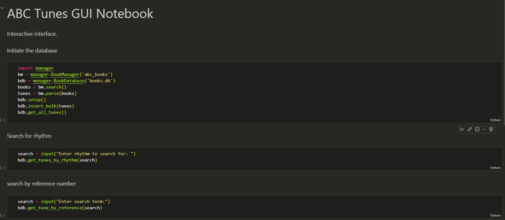

# Data Centric Programming Assignment 2025

- [Assignment Brief](assignment.md)

Name: Alex Rolff

Student Number: C24319666

# Screenshots
gui for the user to access the data

# Description of the project
parsing through different abc files to extract data from it and then inserting into a sql database which is then accessed via a jupyter notebook which allows the user to go through the data 
# Instructions for use
open abc_gui.ipynb and run all the code blocks and enter data
# How it works:
`manager.py` contains two classes for managing the parsing of abc files, and storing the data.

The `BookManager` class obtains a list of possible files using glob, this simplifies the logic of searching for files, and makes it more extensible for future use, for example if the parsing was to become more relaxed or stricter.

It uses regex to refine this list, this isn't an ideal solution as paths are complex strings, but it provides a good trade off between flexibility (it's easy to encode the rules withinm a regex) and correctness.

This class then uses the `ABCParser` to transform the data into sensible normalized classes.

The `BookDatabase` is thin layer abstracting certain database operations into just operations on `Tune` objects, this abstraction simplifies the interaction with the database. `BookDatabase` is populated with analytical methods which are called in the `abc_gui.ipynb`
`abc_gui.ipynb` creates the database for the user and allows them to run commands to query and interact with the data with ease. 

# List of files in the project

| Files | Source |
|-----------|-----------|
| main.py | Self written |
| parser.py | from bryan duggan lab4 analysing_abc.md  |
| manager.py | Self written |

# References
* regex [https://medium.com/@MynaviTechTusVietnam/regex-for-dummies-part-4-capturing-groups-and-backreferences-50c338a3b6f6] 
* OOP[https://www.w3schools.com/python/python_oop.asp] 

# What I am most proud of in the assignment

Successfully using OOP and using regex to efficiently work through the pathing. It was pretty cool to actually use methods as well for the first time efficiently in python and before this I had never done SQL in python. It was fulfilling to see SQL connect to python and how I can use it in for my own projects.
Im also proud of using jupyter notebook because i think it was somewhat intuitive and is easy for the user to use and creative. I dont think many others would have done it or thought about doing it so i think it created an interesting approach

# What I learned

I learned how to use parts of OOP and primarily classes and dataclasses. I learned about the life cycle of analyzing a program and how I can do this in my own time